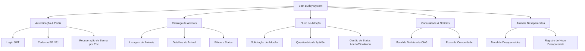

# 🐾 Visão Geral do Projeto Best Buddy
tags: #overview #best-buddy #contexto

## 1. O que é o Best Buddy?
O **Best Buddy** é uma plataforma comunitária voltada para proteção animal, adoção responsável e localização de animais perdidos. O ecossistema visa conectar:
- **Adotantes** (Pessoas Físicas) interessados em acolher cães e gatos.
- **ONGs e Protetores Independentes** (Pessoas Jurídicas / Físicas) que resgatam e cuidam de animais em situação de vulnerabilidade.
- **A Comunidade Local**, compartilhando avisos de animais desaparecidos, notícias sobre feiras de adoção e campanhas de castração/vacinação.

---

## 2. Histórico e Estrutura do Repositório Unificado (Branch: `bruno`)

Inicialmente, o frontend e o backend foram concebidos em pastas/projetos separados por equipes distintas. Para permitir versionamento consistente, implantação contínua e compartilhamento em equipe, o projeto foi **unificado na branch `bruno` do repositório `Best_Buddy`**:

```
Best_Buddy/ (Repositório Git - Branch: bruno)
├── frontend/                          # Aplicação Web completa (Tailwind + Vanilla JS + Nginx)
├── adocoes/                           # App Django de solicitações de adoção
├── animais/                           # App Django de animais cadastrados
├── comunidade/                        # App Django de notícias, posts e desaparecidos
├── config/                            # Configurações do Django (settings, urls, wsgi)
├── usuarios/                          # App Django de autenticação e perfis (PF/PJ)
├── fixtures/                          # Dados de carga inicial (seed_data.json)
├── media/                             # Arquivos de mídia estática
├── vault/                             # Cofre de documentação estruturado para Obsidian
├── db.sqlite3                         # Banco SQLite local pronto e migrado
├── docker-compose.yml                 # Orquestrador com caminhos relativos (db, backend, frontend)
├── Dockerfile                         # Build do container Django
├── entrypoint.sh                      # Inicialização, espera pelo MySQL e seed
├── manage.py                          # CLI do Django
├── seed_data.py                       # Carga inicial automatizada
├── test_endpoints.py                  # Suíte de testes automatizados (9/9 endpoints)
└── requirements.txt                   # Dependências Python
```

---

## 3. Principais Módulos do Sistema



---

## 4. Próximos Passos Gerais
1. Alinhar modelos do backend Django com as necessidades das telas reais do frontend.
2. Corrigir o estado das tabelas e migrações no banco de dados SQLite atual.
3. Conectar o frontend à API real (desligando os Mocks no `js/config.js`).
4. Estruturar a infraestrutura para transição suave para **MySQL**.

Veja também:
- [[02 - Arquitetura do Sistema]]
- [[03 - Transição SQLite para MySQL]]
- [[01 - Matriz de Funcionalidades (O que funciona)]]
