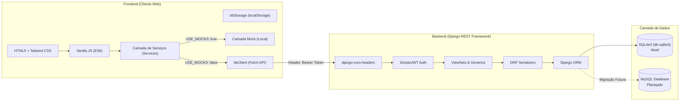

# 🏛️ Arquitetura do Sistema Best Buddy
tags: #architecture #fullstack #django #vanillajs #tailwind

## 1. Visão de Arquitetura Geral

O projeto adota um padrão de **Single Page/Multi-Page Application Estática desacoplada** consumindo uma **API RESTful**.

---

## 2. Tecnologias Utilizadas

### Frontend
- **HTML5 Semântico**: Estrutura acessível com navegação por tags nativas.
- **Vanilla JavaScript (ES6+)**: Sem frameworks pesados (React/Vue/Angular), garantindo leveza absoluta e ausência de bundlers obrigatórios no runtime de produção.
- **Tailwind CSS v3 (CLI)**: Processado localmente ou no CI, com arquivo gerado e minificado (`css/tailwind.build.css`) versionado no repositório.
- **Armazenamento de Sessão**: `localStorage` gerenciado centralizadamente por `js/utils/storage.js`.
- **Deploy**: GitHub Pages via GitHub Actions (totalmente estático).

### Backend
- **Python 3.12+ / 3.14**: Linguagem principal.
- **Django 6.0.x**: Framework web robusto.
- **Django REST Framework (DRF) 3.16.x**: Construção dos endpoints JSON REST.
- **djangorestframework-simplejwt 5.5.x**: Autenticação stateless baseada em JSON Web Tokens (Access + Refresh).
- **django-cors-headers 4.7.x**: Controle de requisições cross-origin para permitir chamadas do front rodando em `localhost:5500`.

---

## 3. Padrões de Comunicação e Segurança

1. **CORS (Cross-Origin Resource Sharing)**:
   - Configurado em `config/settings.py` via `CORS_ALLOWED_ORIGINS` para liberar `http://127.0.0.1:5500` e `http://localhost:5500`.
2. **Autenticação Stateless**:
   - As credenciais (`email` + `password`) são trocadas em `/api/token/` por dois tokens:
     - `access`: Vida curta, enviado em cada requisição HTTP no cabeçalho `Authorization: Bearer <token>`.
     - `refresh`: Vida mais longa, usado para renovar o access token sem deslogar o usuário.
3. **Proteção de Rotas no Front**:
   - Script `js/utils/auth-guard.js` inserido nas páginas privadas (`home`, `community`, `animals`, `adoption`). Se não houver token no storage, redireciona imediatamente para `login.html?next=<url>`.
4. **Proteção de Rotas no Back**:
   - `permission_classes = [IsAuthenticated]` em endpoints que exigem login.
   - Endpoints públicos (leitura de animais e comunidade) devem utilizar `AllowAny` ou `IsAuthenticatedOrReadOnly`.

---

## 4. Separação de Responsabilidades (SoC)

| Camada | Arquivo / Diretório | Responsabilidade |
| :--- | :--- | :--- |
| **Configuração Front** | `js/config.js` | Chave única para ligar/desligar mocks e apontar URL da API. |
| **Cliente HTTP** | `js/api/client.js` | Wrapper de `fetch`, injeção do header JWT e tratamento unificado de erros (`BBApiError`). |
| **Serviços Front** | `js/services/*.js` | Abstração de regras de negócio de cada módulo (auth, animal, adoção, comunidade). |
| **Componentes UI** | `js/components/*.js` | Funções puras de renderização de fragmentos HTML (Navbar, Footer, Cards). |
| **Páginas Front** | `js/pages/*.js` | Escuta de eventos do DOM, chamadas aos serviços e manipulação de estados (loading, erro, sucesso). |
| **Serializers Back** | `*/serializer.py` | Validação de payload JSON de entrada e serialização dos modelos para saída. |
| **Views Back** | `*/views.py` | Regras de autorização, orquestração de queries e respostas HTTP. |
| **Modelos Back** | `*/models.py` | Definição estrutural das entidades do banco de dados e relacionamentos. |

Veja também:
- [[01 - Estrutura e Tecnologias]]
- [[01 - Arquitetura Django REST]]
- [[01 - Contrato de API (Endpoints)]]
