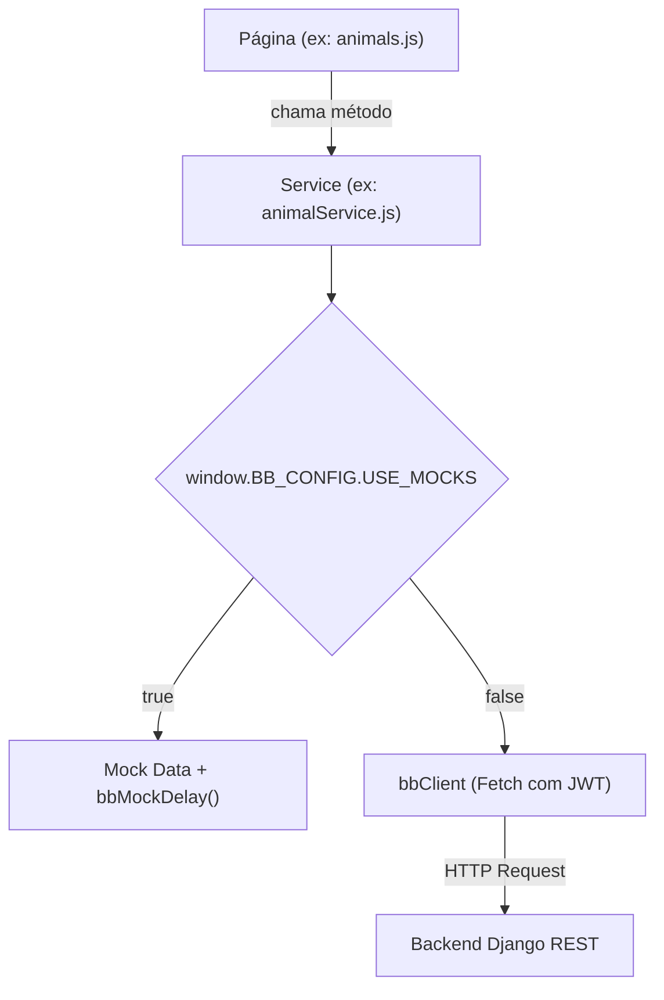

# 🔌 Frontend — Serviços e Camada de API
tags: #frontend #api #services #http #fetch

## 1. Arquitetura da Camada de Serviços

O frontend adota o padrão **Service Layer**, onde as páginas nunca realizam chamadas `fetch` diretas. Todo fluxo passa por um serviço especializado que verifica o modo de operação (`USE_MOCKS` true ou false):



---

## 2. Cliente HTTP Central: `js/api/client.js`

Contém a classe de erro customizada e o objeto `bbClient`:

```javascript
class BBApiError extends Error {
  constructor(message, status, payload) {
    super(message);
    this.status = status;
    this.payload = payload;
  }
}
```

### Funcionalidades do `bbClient`:
- **Injeção Automática de JWT**: Caso `auth: true` (padrão), busca o token no `bbStorage.getAccessToken()` e adiciona o header `Authorization: Bearer <token>`.
- **Parsing Seguro de JSON**: Captura payloads de resposta tanto para status 200 quanto para erros 400/401/404/500.
- **Tratamento de Queda de Rede**: Se a conexão for recusada, lança `BBApiError("Não foi possível conectar ao servidor.", 0, null)`.
- **Métodos Auxiliares**: `get()`, `post()`, `patch()`, `delete()`.

---

## 3. Catálogo de Serviços (`js/services/`)

### `authService.js`
- `login({ email, password })`:
  - Mock: valida contra `BB_MOCK_CREDENTIALS` e devolve `{ access, refresh, user }`.
  - Real: `POST /token/` (atualmente retorna `{ access, refresh }`).
- `register(payload)`:
  - Real: `POST /usuarios/register/`
- `requestPasswordReset(email)`:
  - Real: `POST /usuarios/password-reset/`
- `confirmPasswordReset({ email, pin, password })`:
  - Real: `POST /usuarios/password-reset/confirm/`
- `logout()`:
  - Limpa os tokens com `bbStorage.clearSession()` e redireciona para `login.html`.

### `animalService.js`
- `list()`:
  - Real: `GET /animais/` (lista de animais prontos para adoção).
- `getById(id)`:
  - Real: `GET /animais/{id}/` (ficha detalhada de um único pet).
- `create(payload)`:
  - Real: `POST /animais/` (cadastro de novo animal).

### `adoptionService.js`
- `create(payload)`:
  - Real: `POST /adocoes/`
  - Payload esperado:
    ```json
    {
      "animal_id": 1,
      "nome_adotante": "Ana Souza",
      "email_adotante": "ana@email.com",
      "telefone_adotante": "(16) 99999-8888",
      "ja_teve_animais": "Sim",
      "ja_vacinado": "Sim",
      "motivacao": "Gostaria de adotar para dar amor e carinho."
    }
    ```

### `communityService.js`
- `listNews()`: `GET /comunidade/noticias/`
- `listPosts()`: `GET /comunidade/posts/`
- `listMissingAnimals()`: `GET /comunidade/desaparecidos/`
- `reportMissingAnimal(payload)`: `POST /comunidade/desaparecidos/`

---

## 4. Gerenciamento de Armazenamento: `js/utils/storage.js`

Encapsula o acesso a `localStorage` com prefixo `bb_`:
- `bb_access_token`: Token de curta duração para autenticar no header Bearer.
- `bb_refresh_token`: Token de longa duração para renovação.
- `bb_user`: Objeto JSON com dados básicos (`id`, `nome`, `email`, `tipo`).

> [!TIP]
> Centralizar o `storage.js` permite migrar para Cookies `HttpOnly` no futuro sem alterar uma única linha de código nos componentes ou nas páginas.

Veja também:
- [[04 - Mocks e Modo Desacoplado]]
- [[01 - Contrato de API (Endpoints)]]
