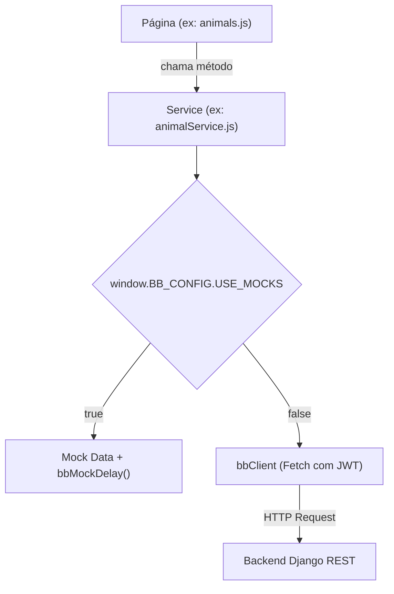

# 🔌 Frontend — Serviços e Camada de API
tags: #frontend #api #services #http #fetch

## 1. Arquitetura da Camada de Serviços

O frontend adota o padrão **Service Layer**, onde as páginas nunca realizam chamadas `fetch` diretas. Todo fluxo passa por um serviço especializado que verifica o modo de operação (`USE_MOCKS` true ou false):


```mermaid
flowchart TD
    Page["Página (ex: animals.js)"]
    Service["Service (ex: animalService.js)"]
    Config{"window.BB_CONFIG.USE_MOCKS"}
    Mock["Mock Data + bbMockDelay()"]
    Client["bbClient (Fetch com JWT)"]
    Backend["Backend Django REST"]

    Page -->|chama método| Service
    Service --> Config
    Config -->|true| Mock
    Config -->|false| Client
    Client -->|HTTP Request| Backend
```

---

## 2. Cliente HTTP Central: `js/api/client.js`

Contém a classe de erro customizada e o objeto `bbClient`:

```javascript
class BBApiError extends Error {
  constructor(message, status, payload) {
    super(message);
    this.status = status;
    this.payload = payload;
  }
}
```

### Funcionalidades do `bbClient`:
- **Injeção Automática de JWT**: Caso `auth: true` (padrão), busca o token no `bbStorage.getAccessToken()` e adiciona o header `Authorization: Bearer <token>`.
- **Renovação Silenciosa (Silent Refresh)**: Se o `access_token` estiver expirado antes da requisição ou se a resposta retornar `401 Unauthorized`, chama `refreshAccessToken()` automaticamente via `/api/token/refresh/`.
- **Fila de Concorrência (`_refreshPromise`)**: Múltiplas requisições simultâneas aguardam a mesma promessa de renovação para não sobrecarregar a API.
- **Auto-Retry Transparente**: Refaz a requisição original com o novo token sem interrupção para o usuário.
- **Tratamento de Sessão Expirada**: Se o `refresh_token` também estiver inválido/expirado, aciona `bbStorage.handleSessionExpired()`.
- **Parsing Seguro de JSON**: Captura payloads de resposta tanto para status 200 quanto para erros 400/401/404/500.
- **Tratamento de Queda de Rede**: Se a conexão for recusada, lança `BBApiError("Não foi possível conectar ao servidor.", 0, null)`.
- **Métodos Auxiliares**: `get()`, `post()`, `patch()`, `delete()`.

---

## 3. Catálogo de Serviços (`js/services/`)

### `authService.js`
- `login({ email, password })`:
  - Mock: valida contra `BB_MOCK_CREDENTIALS` e devolve `{ access, refresh, user }`.
  - Real: `POST /token/` (atualmente retorna `{ access, refresh }`).
- `register(payload)`:
  - Real: `POST /usuarios/register/`
- `requestPasswordReset(email)`:
  - Real: `POST /usuarios/password-reset/`
- `confirmPasswordReset({ email, pin, password })`:
  - Real: `POST /usuarios/password-reset/confirm/`
- `logout()`:
  - Limpa os tokens com `bbStorage.clearSession()` e redireciona para a Home (`/pages/home/index.html`).

### `animalService.js`
Serviço central de gestão e consulta da tabela unificada de animais:
- `list(params)`:
  - Consome `GET /animais/` com suporte a query params:
    - `tipo_servico`: `"ADOCAO"` ou `"PERDIDO"`
    - `estado`: sigla da UF (ex: `"SP"`)
    - `cidade`: nome do município (ex: `"Campinas"`)
    - `tipo_animal`: `"CACHORRO"`, `"GATO"`, `"OUTRO"`
    - `tutor_id`: id do usuário tutor para a aba "Meus Anúncios"
- `getById(id)`:
  - Consome `GET /animais/{id}/` (ficha detalhada de um único pet).
- `create(payload)`:
  - Consome `POST /animais/` (cadastro de anúncio com `telefone_contato` obrigatório com DDD).
- `updateStatus(id, status)`:
  - Consome `PATCH /animais/{id}/` para o tutor atualizar status (ex: `"ADOTADO"` ou `"ENCONTRADO"`).
- `delete(id)`:
  - Consome `DELETE /animais/{id}/` para o tutor excluir seu próprio anúncio.

### `adoptionService.js` (Descontinuado)
> [!WARNING]
> **Descontinuado:** A intermediação burocrática de adoção foi desativada em favor do contato direto via WhatsApp.

### `communityService.js` (Descontinuado / Removido)
> [!WARNING]
> **Descontinuado e Removido:** O módulo de comunidade e notícias foi abandonado. O fluxo de animais desaparecidos foi totalmente unificado em `animalService.js` utilizando `tipo_servico: "PERDIDO"`.

### `ibgeService.js`
Serviço desacoplado para consulta e normalização de dados geográficos sem onerar o banco de dados da aplicação:
- **Lista Estática das 27 UFs (`getEstados()`):** Retorno síncrono e instantâneo (0ms) das 27 unidades federativas brasileiras, sem requisições HTTP desnecessárias.
- **Validação Defensiva (`isUfValida(uf)`):** Valida se a sigla informada existe antes de disparar chamadas externas.
- **Busca Sob Demanda (`getCidadesPorEstado(uf)`):**
  - **Cache Nível 1 (RAM):** `_memoryCache` (Map) para resposta instantânea ao alternar estados na mesma tela.
  - **Cache Nível 2 (Sessão):** `sessionStorage` (`bb_ibge_cidades_{UF}`) para manter dados entre trocas de páginas e recarregamentos (F5) sem gravar permanentemente no disco.
  - **Cache Nível 3 (Rede):** Consulta `https://servicodados.ibge.gov.br/api/v1/localidades/estados/{UF}/municipios?orderBy=nome`.
  - **Timeout Controlado:** 8 segundos via `AbortController` prevenindo bloqueios de UI em redes instáveis.
  - **Normalização de Payload:** Redução de objetos complexos do IBGE para `{ id, nome }`, economizando ~85% de memória.
- **Limpeza (`clearCache()`):** Esvazia o cache em memória e do `sessionStorage`.

---

## 4. Gerenciamento de Armazenamento: `js/utils/storage.js`

Encapsula o acesso a `localStorage` com prefixo `bb_`:
- `bb_access_token`: Token de curta duração para autenticar no header Bearer.
- `bb_refresh_token`: Token de longa duração para renovação.
- `bb_user`: Objeto JSON com dados básicos (`id`, `nome`, `email`, `tipo`).

### Métodos Principais:
- `isTokenExpired(token)`: Decodifica o payload base64 do JWT e avalia `exp * 1000 <= Date.now()`.
- `isAuthenticated()`: Valida a presença e integridade dos tokens, limpando a sessão proativamente se ambos estiverem expirados.
- `setSession({ access, refresh, user })` / `clearSession()`: Persistência e limpeza atômica da sessão.
- `handleSessionExpired()`: Limpa o storage, dispara o evento customizado `bb:auth-state-changed` e redireciona rotas protegidas para `/pages/home/index.html?session=expired`.

> [!TIP]
> Centralizar o `storage.js` permite migrar para Cookies `HttpOnly` no futuro sem alterar uma única linha de código nos componentes ou nas páginas.

Veja também:
- [[04 - Mocks e Modo Desacoplado]]
- [[01 - Contrato de API (Endpoints)]]
