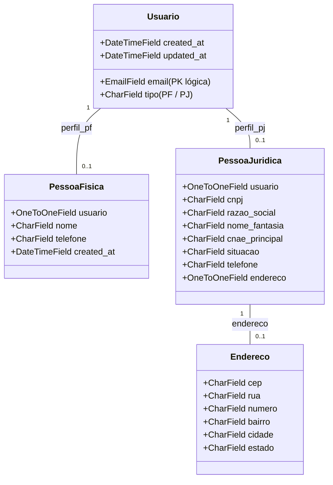

# 👤 Backend — App Usuários e Autenticação
tags: #backend #usuarios #auth #jwt #drf

## 1. Modelagem Atual (`usuarios/models.py`)

O app implementa um usuário customizado herdando de `AbstractUser`:



---

## 2. Divergências e Problemas Identificados

### 1. Ausência do Campo `CPF` em `PessoaFisica`
- **Problema**: O frontend possui validação obrigatória de CPF na tela de cadastro (`register.html`) e envia o campo `"cpf"`.
- **Causa**: Na migration `0003_alter_usuario_managers_remove_pessoafisica_cpf.py`, o campo `cpf` foi expressamente removido do modelo `PessoaFisica`.
- **Impacto**: O serializer de cadastro (`RegisterUsuarioSerializer`) não captura o CPF enviado pelo front.
- **Solução**: Reincluir o campo `cpf = models.CharField(max_length=14, unique=True, null=True, blank=True)` em `PessoaFisica` e atualizar o `RegisterUsuarioSerializer`.

---

### 2. Login Simples via SimpleJWT não retorna dados do Usuário
- **Problema**: A view `TokenObtainPairView` devolve apenas:
  ```json
  { "refresh": "string", "access": "string" }
  ```
- **Impacto no Frontend**: No arquivo `js/services/authService.js`:
  ```javascript
  const data = await bbClient.post("/token/", { email, password });
  return { access: data.access, refresh: data.refresh, user: null };
  ```
  Como `user` volta `null`, o `bbStorage.getUser()` fica vazio e a barra de navegação renderiza `"Olá, visitante"` e iniciais `"U"`.
- **Solução**: Criar um `CustomTokenObtainPairSerializer` que inclua os dados do usuário no payload retornado:
  ```json
  {
    "access": "...",
    "refresh": "...",
    "user": {
      "id": 1,
      "email": "usuario@bestbuddy.com",
      "nome": "Ana Souza",
      "tipo": "PF"
    }
  }
  ```
  E/ou disponibilizar o endpoint `GET /api/usuarios/me/`.

---

### 3. Recuperação de Senha Não Implementada no Backend
- **Problema**: O frontend possui tela completa de recuperação de senha em dois passos (`forgot-password.html`), chamando:
  - `POST /api/usuarios/password-reset/`
  - `POST /api/usuarios/password-reset/confirm/`
- **Situação no Backend**: Esses dois endpoints **não existem** em `usuarios/views.py` nem em `usuarios/urls.py` (retornará 404 Not Found).
- **Solução**: Implementar uma tabela ou lógica de PIN com tempo de expiração (15 minutos) e os endpoints correspondentes.

Veja também:
- [[01 - Arquitetura Django REST]]
- [[02 - Matriz de Divergências (Front vs Back)]]
- [[02 - Tarefas Backend (Django)]]
