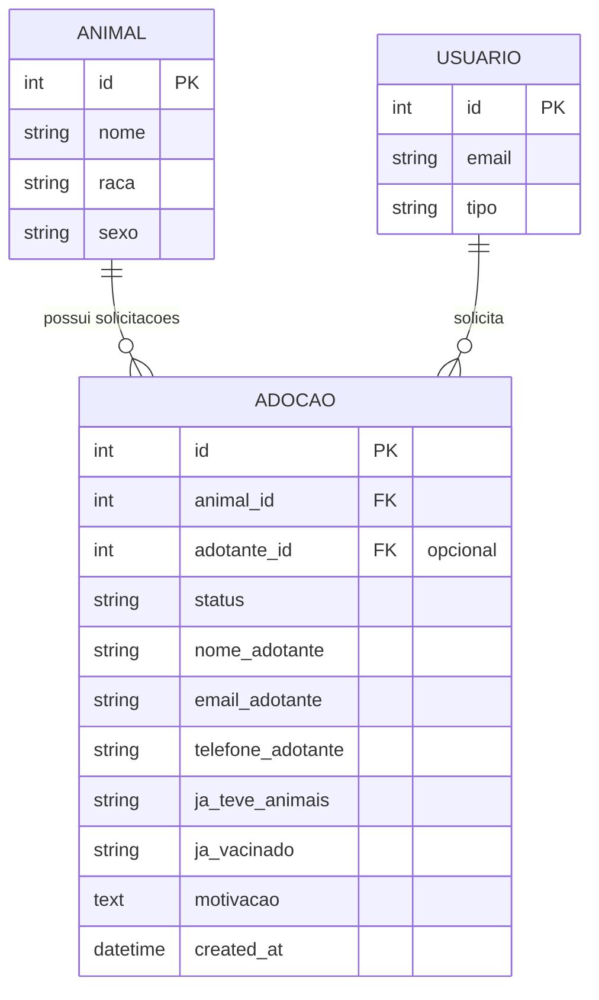

# 📋 Backend — App Adoções
tags: #backend #adocoes #models #refactor #relacionamentos #descontinuado

> [!WARNING]
> **Aviso de Refatoração de Requisitos (Setembro/2026):**
> Conforme definido na revisão de requisitos em [[02 - Requisitos Funcionais#RF13 — Contato Direto para Adoção (Sem Formulário Intermediário)]], o fluxo de **questionário de manifestação de interesse foi descontinuado**. 
> A adoção agora é realizada via **contato direto com o tutor pelo WhatsApp validado** no cadastro do pet. O modelo `Adocao` e o app `adocoes` estão marcados para remoção/descontinuação no roadmap (ver [[06 - Matriz de Gap Analysis (O que Adicionar, Ajustar e Remover)]]).

## 1. Histórico da Modelagem e Refatoração Realizada

Na versão inicial do backend, o modelo `Adocao` continha campos duplicados do animal (`nome`, `raca`, `sexo`) sem qualquer relação com a tabela `Animal` nem identificação do candidato a tutor.

Essa limitação causava erro HTTP 400 ao submeter o formulário de adoção do frontend (`pages/adoption/create.html`).

O modelo foi **completamente refatorado** para estabelecer as chaves relacionais corretas e campos de aptidão à adoção.

---

## 2. O que o Frontend Envia (`adoptionService.js`)

```json
{
  "animal_id": 1,
  "nome_adotante": "Ana Souza",
  "email_adotante": "ana@email.com",
  "telefone_adotante": "(16) 99999-8888",
  "ja_teve_animais": "Sim",
  "ja_vacinado": "Sim",
  "motivacao": "Tenho casa com quintal e amo cachorros."
}
```

---

## 3. Modelo Implementado e Ativo (`adocoes/models.py`)

A entidade `Adocao` representa a **solicitação/processo de adoção**, conectando um adotante a um animal:



### Código Django Sugerido para `adocoes/models.py`:

```python
from django.db import models

class Adocao(models.Model):
    class Status(models.TextChoices):
        ABERTA = "A", "Aberta"
        APROVADA = "P", "Aprovada"
        RECUSADA = "R", "Recusada"
        FINALIZADA = "F", "Finalizada"
        CANCELADA = "C", "Cancelada"

    class RespostaSimNao(models.TextChoices):
        SIM = "Sim", "Sim"
        NAO = "Não", "Não"
        NAO_SEI = "Não sei", "Não sei"

    animal = models.ForeignKey(
        'animais.Animal',
        on_delete=models.CASCADE,
        related_name='adocoes',
        verbose_name="Animal"
    )
    adotante = models.ForeignKey(
        'usuarios.Usuario',
        on_delete=models.SET_NULL,
        null=True,
        blank=True,
        related_name='minhas_adocoes',
        verbose_name="Usuário Adotante"
    )

    status = models.CharField(
        max_length=1,
        choices=Status.choices,
        default=Status.ABERTA,
        verbose_name="Status da Adoção"
    )

    # Dados do adotante no momento da solicitação
    nome_adotante = models.CharField(max_length=100, verbose_name="Nome do Adotante")
    email_adotante = models.EmailField(verbose_name="Email do Adotante")
    telefone_adotante = models.CharField(max_length=20, verbose_name="Telefone do Adotante")

    # Perguntas do questionário de adoção
    ja_teve_animais = models.CharField(
        max_length=10,
        choices=RespostaSimNao.choices,
        default=RespostaSimNao.NAO,
        verbose_name="Já teve animais antes?"
    )
    ja_vacinado = models.CharField(
        max_length=10,
        choices=RespostaSimNao.choices,
        default=RespostaSimNao.SIM,
        verbose_name="Pretende manter vacinação em dia?"
    )
    motivacao = models.TextField(
        max_length=1000,
        verbose_name="Motivação para a adoção"
    )

    created_at = models.DateTimeField(auto_now_add=True)
    updated_at = models.DateTimeField(auto_now=True)

    class Meta:
        verbose_name = 'Adoção'
        verbose_name_plural = 'Adoções'
        ordering = ['-created_at']

    def __str__(self):
        return f"Adoção #{self.id} - {self.animal.nome} para {self.nome_adotante}"
```

### Serializer Proposto (`adocoes/serializer.py`):
```python
from rest_framework import serializers
from .models import Adocao

class AdocoesSerializer(serializers.ModelSerializer):
    animal_id = serializers.PrimaryKeyRelatedField(
        queryset=Animal.objects.all(),
        source='animal'
    )

    class Meta:
        model = Adocao
        fields = [
            'id',
            'animal_id',
            'status',
            'nome_adotante',
            'email_adotante',
            'telefone_adotante',
            'ja_teve_animais',
            'ja_vacinado',
            'motivacao',
            'created_at',
        ]
        read_only_fields = ['id', 'status', 'created_at']
```

Veja também:
- [[03 - App Animais]]
- [[01 - Contrato de API (Endpoints)]]
- [[02 - Tarefas Backend (Django)]]
