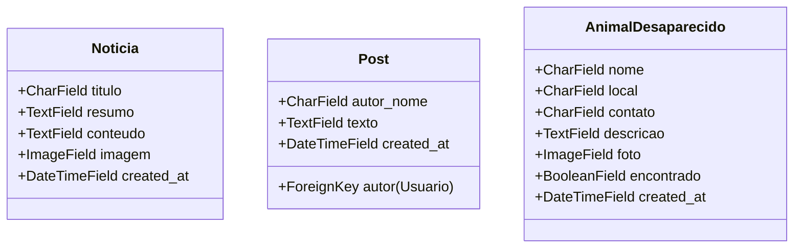

# 👥 Backend — App Comunidade
tags: #backend #comunidade #implementado #posts #noticias #desaparecidos

## 1. Visão Geral e Propósito

O app `comunidade` atende às demandas sociais e de engajamento da ONG Best Buddy, consumido diretamente pelas seguintes páginas do frontend:
1. `pages/home/index.html` (Carrega Notícias e Posts em destaque).
2. `pages/community/index.html` (Carrega Posts, Mural de Animais Desaparecidos e permite cadastrar novos relatos).

O app foi **criado, integrado e migrado** com sucesso no backend Django, eliminando os erros 404 e permitindo a persistência de notícias, postagens e animais perdidos.

---

## 2. Modelagem Proposta (`comunidade/models.py`)



### Código Django Sugerido:

```python
from django.db import models
from django.conf import settings

class Noticia(models.Model):
    titulo = models.CharField(max_length=200, verbose_name="Título")
    resumo = models.TextField(verbose_name="Resumo / Subtítulo")
    conteudo = models.TextField(blank=True, verbose_name="Conteúdo Completo")
    imagem = models.ImageField(upload_to="noticias/", null=True, blank=True)
    created_at = models.DateTimeField(auto_now_add=True)

    class Meta:
        verbose_name = "Notícia"
        verbose_name_plural = "Notícias"
        ordering = ['-created_at']

    def __str__(self):
        return self.titulo


class Post(models.Model):
    autor = models.ForeignKey(
        settings.AUTH_USER_MODEL,
        on_delete=models.SET_NULL,
        null=True,
        blank=True,
        related_name="posts"
    )
    autor_nome = models.CharField(max_length=100, verbose_name="Nome do Autor")
    texto = models.TextField(max_length=1000, verbose_name="Texto do Post")
    created_at = models.DateTimeField(auto_now_add=True)

    class Meta:
        verbose_name = "Post da Comunidade"
        verbose_name_plural = "Posts da Comunidade"
        ordering = ['-created_at']

    def __str__(self):
        return f"{self.autor_nome}: {self.texto[:30]}..."


class AnimalDesaparecido(models.Model):
    nome = models.CharField(max_length=100, verbose_name="Nome do Animal")
    local = models.CharField(max_length=200, verbose_name="Último local visto")
    contato = models.CharField(max_length=30, verbose_name="Contato do Tutor")
    descricao = models.TextField(verbose_name="Descrição do Animal / Características")
    foto = models.ImageField(upload_to="desaparecidos/", null=True, blank=True)
    encontrado = models.BooleanField(default=False)
    created_at = models.DateTimeField(auto_now_add=True)

    class Meta:
        verbose_name = "Animal Desaparecido"
        verbose_name_plural = "Animais Desaparecidos"
        ordering = ['-created_at']

    def __str__(self):
        return f"{self.nome} ({self.local})"
```

---

## 3. Endpoints a Serem Expostos

| Método | URL | Descrição | Permissão |
| :--- | :--- | :--- | :--- |
| `GET` | `/api/comunidade/noticias/` | Lista últimas notícias | `AllowAny` |
| `GET` | `/api/comunidade/posts/` | Feed de posts da comunidade | `AllowAny` |
| `POST`| `/api/comunidade/posts/` | Criar novo post no feed | `IsAuthenticated` |
| `GET` | `/api/comunidade/desaparecidos/` | Lista animais desaparecidos | `AllowAny` |
| `POST`| `/api/comunidade/desaparecidos/` | Cadastrar animal desaparecido | `AllowAny` / `IsAuthenticated` |

---

## 4. Status da Implementação no Django [CONCLUÍDO]
1. ✅ `comunidade` criado e registrado em `INSTALLED_APPS` (`config/settings.py`).
2. ✅ Modelos `Noticia`, `Post` e `AnimalDesaparecido` implementados em `comunidade/models.py`.
3. ✅ Serializers criados em `comunidade/serializers.py`.
4. ✅ Views genéricas com `AllowAny` implementadas em `comunidade/views.py`.
5. ✅ Rotas registradas em `comunidade/urls.py` e incluídas no `config/urls.py`.
6. ✅ Migração `comunidade.0001_initial` gerada e aplicada.
7. ✅ Dados de exemplo inseridos via `seed_data.py` e validados via `test_endpoints.py`.

Veja também:
- [[01 - Contrato de API (Endpoints)]]
- [[04 - Guia de Execução e Testes]]
- [[05 - Configuração e Uso do Docker]]
