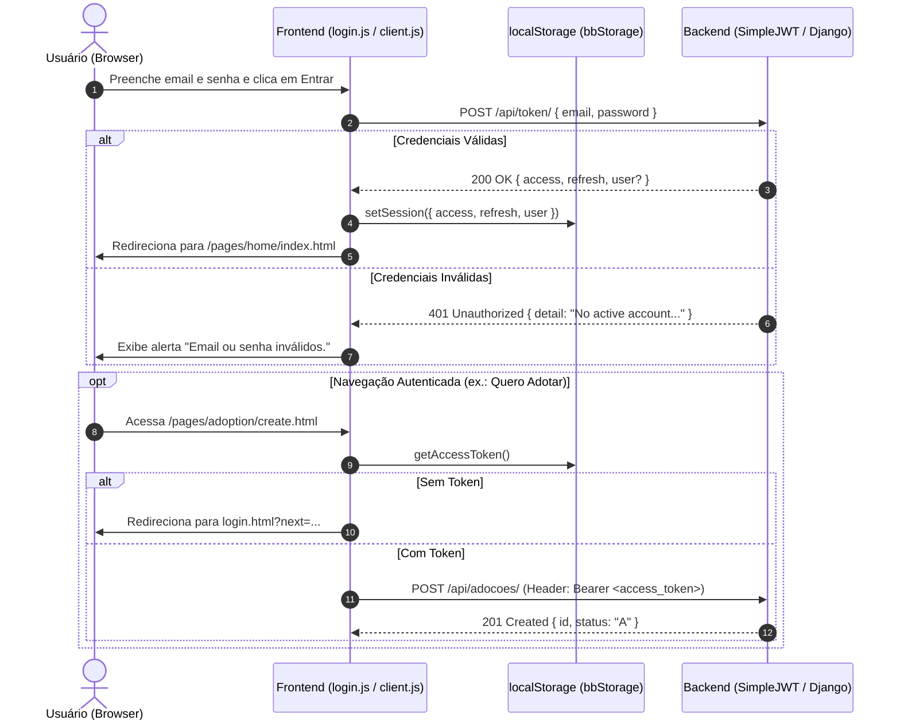

# 🔐 Integração — Fluxo de Autenticação JWT
tags: #auth #jwt #security #drf #simplejwt #tokens

## 1. Diagrama de Sequência da Autenticação



---

## 2. Estrutura dos Tokens SimpleJWT

### Access Token
- **Função**: Autenticar requisições na API.
- **Validade Recomendada**: 15 a 60 minutos.
- **Transporte**: Cabeçalho HTTP `Authorization: Bearer <access_token>`.

### Refresh Token
- **Função**: Gerar novo `access_token` sem forçar o usuário a digitar email e senha novamente.
- **Validade Recomendada**: 1 a 7 dias.
- **Endpoint**: `POST /api/token/refresh/` com payload `{"refresh": "<refresh_token>"}`.

---

## 3. Melhoria Recomendada: Token Customizado com Dados do Usuário

Por padrão, o SimpleJWT devolve apenas:
```json
{
  "access": "...",
  "refresh": "..."
}
```

Para que o frontend possa exibir o nome do usuário no topo da tela (`Navigation.js`) sem precisar fazer uma segunda requisição, implementa-se um serializer customizado no Django:

```python
# usuarios/serializer.py
from rest_framework_simplejwt.serializers import TokenObtainPairSerializer

class CustomTokenObtainPairSerializer(TokenObtainPairSerializer):
    def validate(self, attrs):
        data = super().validate(attrs)
        
        nome = ""
        if self.user.tipo == "PF" and hasattr(self.user, 'perfil_pf'):
            nome = self.user.perfil_pf.nome
        elif self.user.tipo == "PJ" and hasattr(self.user, 'perfil_pj'):
            nome = self.user.perfil_pj.nome_fantasia or self.user.perfil_pj.razao_social

        data['user'] = {
            'id': self.user.id,
            'email': self.user.email,
            'tipo': self.user.tipo,
            'nome': nome,
        }
        return data
```

E no `config/urls.py`:
```python
from rest_framework_simplejwt.views import TokenObtainPairView
from usuarios.serializer import CustomTokenObtainPairSerializer

class CustomTokenObtainPairView(TokenObtainPairView):
    serializer_class = CustomTokenObtainPairSerializer

urlpatterns = [
    # ...
    path('api/token/', CustomTokenObtainPairView.as_view(), name='token_obtain_pair'),
]
```

Dessa forma, o `authService.login()` do frontend armazena diretamente `data.user` no `bbStorage.setSession()`, ativando imediatamente a saudação `"Olá, Ana"` e o avatar `"A"`.

Veja também:
- [[02 - App Usuários e Autenticação]]
- [[03 - Serviços e Camada de API]]
