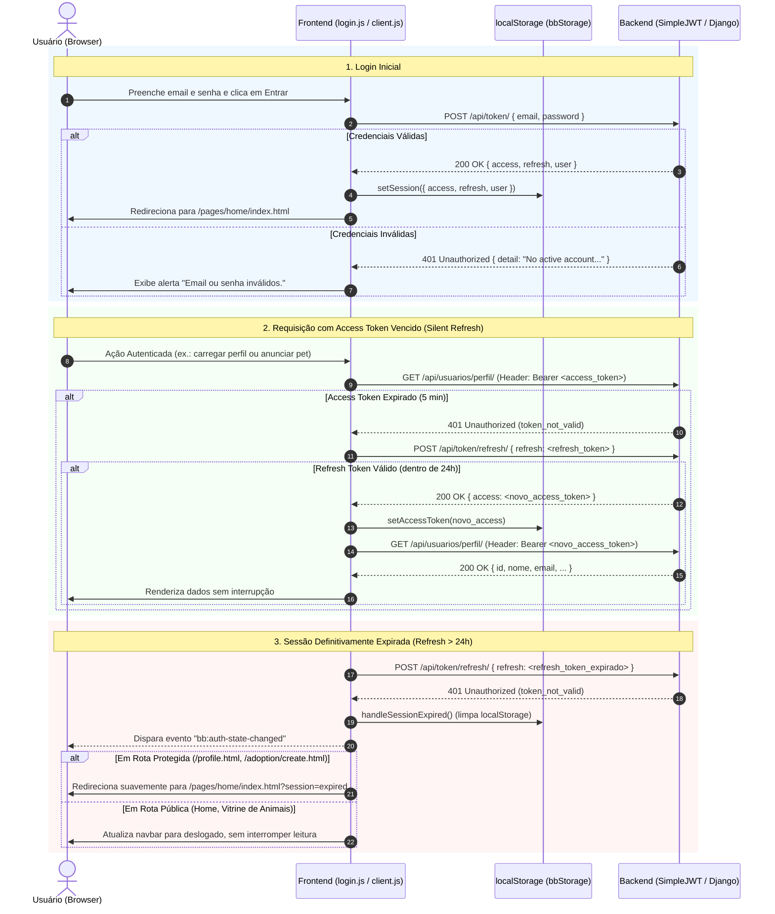

# 🔐 Integração — Fluxo de Autenticação JWT
tags: #auth #jwt #security #drf #simplejwt #tokens #silent-refresh

## 1. Diagrama de Sequência da Autenticação e Renovação Silenciosa


```mermaid
sequenceDiagram
    autonumber
    actor Usuario as Usuário (Browser)
    participant Front as Frontend (login.js / client.js)
    participant Storage as localStorage (bbStorage)
    participant Back as Backend (SimpleJWT / Django)

    %% FLUXO DE LOGIN
    rect rgb(240, 248, 255)
    Note over Usuario, Back: 1. Login Inicial
    Usuario->>Front: Preenche email e senha e clica em Entrar
    Front->>Back: POST /api/token/ { email, password }
    alt Credenciais Válidas
        Back-->>Front: 200 OK { access, refresh, user }
        Front->>Storage: setSession({ access, refresh, user })
        Front->>Usuario: Redireciona para /pages/home/index.html
    else Credenciais Inválidas
        Back-->>Front: 401 Unauthorized { detail: "No active account..." }
        Front->>Usuario: Exibe alerta "Email ou senha inválidos."
    end
    end

    %% FLUXO NORMAL E SILENT REFRESH
    rect rgb(245, 255, 245)
    Note over Usuario, Back: 2. Requisição com Access Token Vencido (Silent Refresh)
    Usuario->>Front: Ação Autenticada (ex.: carregar perfil ou anunciar pet)
    Front->>Back: GET /api/usuarios/perfil/ (Header: Bearer <access_token>)
    alt Access Token Expirado (5 min)
        Back-->>Front: 401 Unauthorized (token_not_valid)
        Front->>Back: POST /api/token/refresh/ { refresh: <refresh_token> }
        alt Refresh Token Válido (dentro de 24h)
            Back-->>Front: 200 OK { access: <novo_access_token> }
            Front->>Storage: setAccessToken(novo_access)
            Front->>Back: GET /api/usuarios/perfil/ (Header: Bearer <novo_access_token>)
            Back-->>Front: 200 OK { id, nome, email, ... }
            Front->>Usuario: Renderiza dados sem interrupção
        end
    end
    end

    %% SESSÃO DEFINITIVAMENTE EXPIRADA
    rect rgb(255, 245, 245)
    Note over Usuario, Back: 3. Sessão Definitivamente Expirada (Refresh > 24h)
    Front->>Back: POST /api/token/refresh/ { refresh: <refresh_token_expirado> }
    Back-->>Front: 401 Unauthorized (token_not_valid)
    Front->>Storage: handleSessionExpired() (limpa localStorage)
    Front-->>Usuario: Dispara evento "bb:auth-state-changed"
    alt Em Rota Protegida (/profile.html, /adoption/create.html)
        Front->>Usuario: Redireciona suavemente para /pages/home/index.html?session=expired
    else Em Rota Pública (Home, Vitrine de Animais)
        Front->>Usuario: Atualiza navbar para deslogado, sem interromper leitura
    end
    end
```

---

## 2. Estrutura e Ciclo de Vida dos Tokens SimpleJWT

No backend Django, os tempos de expiração configurados são os padrões do `djangorestframework-simplejwt`:

| Token | Validade | Armazenamento | Finalidade |
| :--- | :--- | :--- | :--- |
| **`access_token`** | **5 minutos** | `localStorage` (`bb_access_token`) | Enviado no header `Authorization: Bearer <token>` em toda requisição autenticada. |
| **`refresh_token`** | **24 horas (1 dia)** | `localStorage` (`bb_refresh_token`) | Utilizado exclusivamente para renovação silenciosa via `POST /api/token/refresh/`. |

> [!TIP]
> Caso queira estender esses tempos no futuro, configure `SIMPLE_JWT` no `config/settings.py`:
> ```python
> from datetime import timedelta
> SIMPLE_JWT = {
>     "ACCESS_TOKEN_LIFETIME": timedelta(minutes=30),
>     "REFRESH_TOKEN_LIFETIME": timedelta(days=7),
> }
> ```

---

## 3. Arquitetura da Solução no Frontend

### A. Validação Proativa no Navegador (`js/utils/storage.js`)
O frontend decodifica o payload base64 do JWT diretamente no navegador via método `isTokenExpired(token)`.
- Se o `access_token` e o `refresh_token` expiraram, `bbStorage.isAuthenticated()` retorna `false` imediatamente, limpando a sessão.
- Evita carregar estados falsos de autenticação na UI (como *"Olá, Usuário"*) com dados já mortos.

### B. Interceptor e Auto-Retry no Cliente HTTP (`js/api/client.js`)
- **Fila e Bloqueio de Concorrência (`_refreshPromise`)**: Garante que múltiplas chamadas concorrentes compartilhem a mesma promessa de renovação, evitando chamadas duplicadas a `/api/token/refresh/`.
- **Auto-Retry Transparente**: Se uma requisição receber `401 Unauthorized`, o client busca um novo token silenciosamente e refaz a requisição original com o novo token de acesso.
- **Gatilho de Encerramento**: Se a renovação falhar (pois o refresh token também venceu), dispara `bbStorage.handleSessionExpired()`.

### C. Estratégia de Logout Suave (Graceful Expiration)
- **Rotas Públicas (Home, Animais)**: A aplicação emite o evento `bb:auth-state-changed`. A barra de navegação (`Navigation.js`) se re-renderiza para os botões *"Entrar"* e *"Cadastre-se"*, sem forçar reload nem chutar o usuário do que estava lendo.
- **Rotas Restritas (Perfil, Criar Adoção)**: O usuário é redirecionado para a **Home** (`/pages/home/index.html?session=expired`). A Home exibe um aviso discreto e fecha-se automaticamente com `history.replaceState`.

---

## 4. Token Customizado com Dados do Usuário

No login inicial, o backend utiliza `CustomTokenObtainPairSerializer` (`usuarios/serializer.py`), devolvendo:
```json
{
  "access": "...",
  "refresh": "...",
  "user": {
    "id": 1,
    "email": "usuario@exemplo.com",
    "tipo": "PF",
    "nome": "Ana Silva"
  }
}
```
O frontend armazena `user` no `bbStorage.setSession()`, permitindo renderizar a saudação `"Olá, Ana"` e o avatar `"A"` na navbar sem requisições adicionais.

Veja também:
- [[02 - App Usuários e Autenticação]]
- [[03 - Serviços e Camada de API]]
- [[01 - Matriz de Funcionalidades (O que funciona)]]
