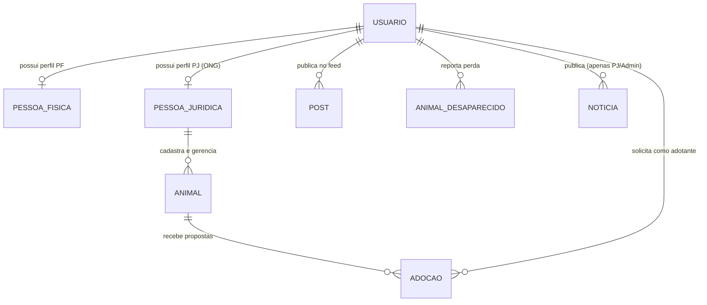

# 🤝 Guia de Alinhamento da Equipe e Novo Roadmap

tags: #roadmap #equipe #planejamento #arquitetura #regras-de-negocio

Este documento foi criado para servir de **guia prático para a reunião da equipe**. Ele responde todas as dúvidas levantadas sobre regras de negócio, modelagem de banco de dados, fluxo de telas e organização do time, garantindo que o projeto avance de forma segura, sem retrabalho ou quebras no Git.

---

## 🗣️ 1. Como Abrir a Reunião com a Equipe (Roteiro Rápido)

> [!TIP]
> **Dica para a reunião:** 
> Você pode abrir a conversa de forma amigável e construtiva:
> *"Pessoal, antes de continuarmos codando novas telas ou endpoints, precisamos alinhar as regras do jogo. Nosso projeto já tem backend e frontend funcionando, mas precisamos definir exatamente o que cada tela faz, quem pode acessar o que, e como vamos organizar o Git para ninguém sobrescrever o trabalho do outro."*

### 🛑 Três Regras de Ouro para o Time (Boas Práticas de Git)
1. **Nunca mexer na raiz do projeto para coisas de tela**: 
   - Todo arquivo de tela, script ou estilo deve ficar **estritamente dentro da pasta `frontend/`**.
   - A raiz do repositório pertence apenas ao Django (Backend), Docker e configurações gerais.
2. **Trabalhar sempre em branches separadas**:
   - Ninguém dá push direto na `main`. Criem branches do tipo `feature/tela-detalhes`, `feature/filtro-posts` ou `fix/logout`.
3. **Rodar os testes antes de subir alterações**:
   - Basta rodar `python test_endpoints.py` para garantir que a API continua 100% íntegra.

---

## 🔐 2. Níveis de Acesso: O que o Usuário Pode ou Não Fazer?

Hoje o frontend possui um bug estrutural: ele bloqueia toda a navegação com `auth-guard.js`, forçando o usuário a logar até para ver a página inicial. A regra correta deve ser:

```mermaid
graph TD
    A[Visitante Não Logado] -->|Pode Acessar| B[Home: Notícias, Banners, Sobre]
    A -->|Pode Acessar| C[Catálogo de Animais e Detalhes]
    A -->|Pode Acessar| D[Comunidade: Ler posts e desaparecidos]
    A -->|Pode Acessar| E[Formulário de Dúvidas/Sugestões]
    A -->|Tenta Adotar ou Postar| F[Modal/Redirecionamento para Login]

    G[Usuário Logado - PF] -->|Tudo do Visitante +| H[Enviar Solicitação de Adoção]
    G -->|Tudo do Visitante +| I[Criar Posts na Comunidade]
    G -->|Tudo do Visitante +| J[Cadastrar Pet Desaparecido - Limite de 2]
    G -->|Tudo do Visitante +| K[Acompanhar Minhas Adoções]

    L[ONG / Administrador - PJ] -->|Tudo do Usuário +| M[Cadastrar Animais para Adoção]
    L -->|Tudo do Usuário +| N[Aprovar / Recusar Solicitações]
    L -->|Tudo do Usuário +| O[Publicar Notícias e Banners Oficiais]
```

### Detalhamento das Permissões:
| Funcionalidade | Visitante (Sem Login) | Usuário Logado (PF) | ONG / Admin (PJ) |
| :--- | :---: | :---: | :---: |
| Visualizar Home, Notícias e Banners | 🟢 Sim | 🟢 Sim | 🟢 Sim |
| Visualizar Catálogo de Pets e Ficha | 🟢 Sim | 🟢 Sim | 🟢 Sim |
| Ler Feed e Animais Desaparecidos | 🟢 Sim | 🟢 Sim | 🟢 Sim |
| Enviar Sugestão / Dúvida no Rodapé | 🟢 Sim | 🟢 Sim | 🟢 Sim |
| **Solicitar Adoção de Animal** | 🔴 Redireciona Login | 🟢 Sim | 🟡 Opcional |
| **Criar Post na Comunidade** | 🔴 Redireciona Login | 🟢 Sim | 🟢 Sim |
| **Reportar Animal Desaparecido** | 🔴 Redireciona Login | 🟢 Sim (Máx. 2 ativos) | 🟢 Sim |
| **Cadastrar Animal para Adoção** | 🔴 Não | 🔴 Não | 🟢 Sim |
| **Gerenciar Status da Adoção** | 🔴 Não | 🔴 Não | 🟢 Sim |
| **Criar Notícia / Banner** | 🔴 Não | 🔴 Não | 🟢 Sim |

---

## 🗄️ 3. Arquitetura do Banco de Dados: Tabelas e Relacionamentos

Aqui está a modelagem ideal para o banco (MySQL / SQLite), com as propriedades essenciais e relacionamentos entre entidades:

### 1. `Usuario` (Tabela `usuarios_usuario`)
- `id` (PK, Inteiro)
- `email` (String único)
- `password` (String criptografada)
- `tipo` ('PF' para Pessoa Física ou 'PJ' para ONG/Empresa)
- `created_at`, `updated_at` (Datas)

### 2. `PessoaFisica` (Tabela `usuarios_pessoafisica`)
- `id` (PK)
- `usuario_id` (FK 1:1 -> `Usuario`)
- `nome` (String)
- `cpf` (String 14 caracteres)
- `telefone` (String)

### 3. `PessoaJuridica` / ONG (Tabela `usuarios_pessoajuridica`)
- `id` (PK)
- `usuario_id` (FK 1:1 -> `Usuario`)
- `razao_social`, `nome_fantasia` (Strings)
- `cnpj` (String 14 ou 18 caracteres)
- `telefone`, `endereco_id` (FK)

### 4. `Animal` (Tabela `animais_animal`)
- `id` (PK)
- `nome`, `raca` (Strings)
- `sexo` ('M', 'F', 'I')
- `idade_aproximada` ('Filhote', 'Adulto', 'Idoso')
- `medicamento`, `vacinacao` ('Sim', 'Não', 'Não sei')
- `descricao` (Texto descritivo com história e temperamento)
- `imagem` (URL da foto do animal)
- `contato` (Telefone/WhatsApp da ONG responsável)
- `status` ('Disponível', 'Em processo de adoção', 'Adotado') — *Novo campo sugerido*
- `ong_responsavel_id` (FK -> `PessoaJuridica`) — *Novo campo sugerido*

### 5. `Adocao` (Tabela `adocoes_adocao`)
- `id` (PK)
- `animal_id` (FK -> `Animal`)
- `adotante_id` (FK -> `Usuario`)
- `nome_adotante`, `email_adotante`, `telefone_adotante` (Strings)
- `ja_teve_animais`, `ja_vacinado` ('Sim', 'Não')
- `motivacao` (Texto livre com motivações e tipo de residência)
- `status` ('Aberta', 'Aprovada', 'Recusada', 'Finalizada', 'Cancelada')
- `created_at` (Data da submissão)

### 6. `Post` da Comunidade (Tabela `comunidade_post`)
- `id` (PK)
- `usuario_id` (FK -> `Usuario`)
- `autor` (String com nome do autor)
- `texto` (Texto até 1000 caracteres)
- `likes_count` (Inteiro, padrão 0) — *Necessário para o filtro de "Mais interagidos"*
- `created_at` (Data do post)

### 7. `AnimalDesaparecido` (Tabela `comunidade_animaldesaparecido`)
- `id` (PK)
- `usuario_id` (FK -> `Usuario`, para controle de autoria e limites de postagem)
- `nome`, `local`, `contato` (Strings)
- `descricao` (Texto)
- `foto` (URL da foto)
- `encontrado` (Booleano, padrão `False`)
- `created_at` (Data do registro)

### 8. `Noticia` / Banners (Tabela `comunidade_noticia`)
- `id` (PK)
- `titulo`, `resumo`, `conteudo` (Textos)
- `imagem` (URL da imagem/banner)
- `tipo` ('Geral', 'Campanha de Vacinação', 'Feira de Adoção')
- `created_at` (Data de publicação)

### 9. `MensagemContato` (Tabela `comunidade_mensagemcontato`) — *Nova sugestão*
- `id` (PK)
- `nome`, `email`, `assunto`, `mensagem` (Strings)
- `created_at` (Data de envio)

---

## 💡 4. Respostas Diretas às Dúvidas da Equipe

### Dúvida 1: Qual a diferença entre a aba "Animais" e a aba "Adoção"?
- **Situação Atual**: Hoje, clicar em "Animais" leva ao catálogo de pets (`pages/animals/index.html`), e clicar em "Adoção" leva direto para um formulário de solicitação de adoção (`pages/adoption/create.html`).
- **Problema**: O usuário entra no formulário de adoção sem ter escolhido nenhum animal previamente, o que gera erro ou confusão.
- **Solução Recomendada**:
  1. A aba **"Animais"** é o **Catálogo de Adoção** (onde as pessoas navegam e conhecem os pets).
  2. O formulário de **"Adoção"** só deve ser aberto a partir do botão **"Quero Adotar"** dentro da página de detalhes do animal (`detail.html?id=1`).
  3. No menu superior (navbar), em vez de um link solto para "Adoção", devemos ter:
     - Ou apenas **"Animais"**;
     - Ou, quando logado, **"Minhas Adoções"** (onde o adotante vê o status dos pedidos que já enviou: Aberto, Aprovado, etc.).

---

### Dúvida 2: Por que a Home força o usuário a logar e o botão "Sair" não funciona direito?
- **Causa da Home bloquear**: O arquivo `pages/home/index.html` possui o script `auth-guard.js`. Esse script foi feito para páginas 100% privadas. Como ele roda logo ao abrir a página, ele chuta quem não tem token para o login.
  - **Correção**: Remover o `auth-guard.js` da Home, de Animais e de Comunidade. O porteiro só deve ficar na tela de submissão de adoção e criação de posts.
- **Causa do botão Sair**: Em `Navigation.js`, o botão limpa o `localStorage` e redireciona para `/pages/auth/login.html`. Mas se o usuário estiver navegando por caminhos relativos ou se o navegador mantiver o estado, pode parecer que não deslogou. 
  - **Correção**: Ajustar a função de logout para limpar o token e redirecionar para a **Home pública** (`/pages/home/index.html`), atualizando a navbar para o estado de visitante ("Entrar / Cadastrar").

---

### Dúvida 3: Como vai funcionar o Banner e as Notícias da Home?
- O banner carrossel no topo da Home (`HeroCarousel.js`) já consome dados de notícias.
- Sugestão simples para a equipe: No backend, a tabela `Noticia` deve ter um campo `tipo` (ex.: `"Campanha de Vacinação"`, `"Feira de Adoção"`, `"Notícia da Semana"`).
- O banner da Home consome os itens mais recentes com imagem e link.

---

### Dúvida 4: Quem pode criar notícias e quem pode criar posts na Comunidade?
- **Feed da Comunidade (estilo Reddit simples)**: 
  - Qualquer **usuário logado (PF ou PJ)** pode criar posts de texto curto (dúvidas, dicas de cuidados, relatos de pets adotados).
  - **Filtro**: A página de comunidade deve ter dois botões: **"Mais Recentes"** (ordenação por `created_at desc`) e **"Mais Curtidos"** (ordenação por `likes_count desc`).
- **Mural de Notícias e Banners**:
  - **Apenas Administradores e ONGs (PJ)** podem criar notícias oficiais para evitar fake news ou spam nas campanhas oficiais.

---

### Dúvida 5: Regras de Animais Perdidos (Limites anti-spam)
- **Quem pode postar**: Apenas usuários autenticados (para termos o contato real do tutor e evitar trotes).
- **Limite de animais perdidos ativos**:
  - **Regra**: Cada usuário só pode ter no máximo **2 animais com status `encontrado=False` simultaneamente**.
  - Se ele tentar cadastrar um terceiro, a API bloqueia: *"Você atingiu o limite de buscas ativas. Por favor, marque seus pets anteriores como encontrados ou finalize a busca antes de cadastrar um novo."*
  - Isso mantém a base limpa e os tutores engajados em atualizar o status quando acharem seus bichinhos.

---

### Dúvida 6: O formulário de sugestões/problemas no rodapé funciona?
- **Hoje**: Ele apenas tem um listener de evento em JavaScript que exibe um `alert("Mensagem enviada!")` e limpa os inputs. Ele **não grava em nenhum banco de dados**.
- **Para fazer funcionar de verdade**:
  1. Criar um modelo simples no Django: `MensagemSuporte` (`nome`, `email`, `assunto`, `data`).
  2. Criar um endpoint `POST /api/suporte/`.
  3. Fazer o formulário do rodapé enviar esses dados via `fetch`.

---

## 🗺️ 5. Roadmap de Execução Proposto (Passo a Passo)

Para ninguém se atropelar, dividimos o trabalho em **3 Sprints claras**:

### 🎯 Sprint 1: Liberação do Acesso Público e Experiência do Visitante (Urgente)
- [ ] **Frontend**: Remover `auth-guard.js` de `pages/home/index.html`, `pages/community/index.html` e `pages/animals/index.html`.
- [ ] **Frontend**: Adaptar a `Navigation.js` para ter dois estados visuais:
  - **Deslogado**: Mostra botões "Entrar" e "Cadastrar".
  - **Logado**: Mostra avatar, primeiro nome do usuário e botão "Sair".
- [ ] **Frontend**: Corrigir o botão "Sair" para limpar o storage e recarregar a Home no modo visitante.
- [ ] **Frontend / UX**: Remover a aba "Adoção" solta da navbar e garantir que o fluxo de adoção seja sempre disparado a partir do botão "Quero Adotar" de cada pet.

### 🎯 Sprint 2: Regras da Comunidade e Desaparecidos
- [ ] **Backend**: Adicionar campo `likes_count` ao modelo `Post` e criar endpoint de curtir (`POST /api/comunidade/posts/{id}/like/`).
- [ ] **Backend**: Implementar trava anti-spam no `AnimalDesaparecido` (máximo 2 ativos por usuário logado).
- [ ] **Frontend**: Criar filtro de ordenação na tela de comunidade ("Mais Recentes" vs "Mais Interagidos").
- [ ] **Frontend**: Substituir o `prompt()` nativo do botão "Reportar Desaparecido" por um modal moderno em Tailwind.

### 🎯 Sprint 3: Fechamento de Ciclo (Suporte e Gestão de Adoções)
- [ ] **Backend & Frontend**: Criar endpoint e persistência real para o formulário de sugestões do rodapé.
- [ ] **Frontend**: Criar página ou modal "Minhas Adoções" para o usuário logado acompanhar se sua solicitação foi aceita ou está em análise.
- [ ] **Backend**: Restringir criação de Notícias/Banners apenas para usuários administradores ou ONGs (`tipo == 'PJ'`).

---

## 💡 Resumo das Tarefas por Pessoa (Sugestão de Divisão)

- **Colega focado em Telas/HTML/CSS**:
  - Ajustar a barra de navegação (`Navigation.js`) para suportar visitante vs logado.
  - Desenhar o modal de "Reportar Animal Perdido" com Tailwind (substituindo o `prompt`).
- **Colega focado em JavaScript/API**:
  - Ajustar o clique do botão "Sair" e remover o `auth-guard` das páginas públicas.
  - Implementar os botões de filtro ("Recentes" / "Mais curtidos") na tela de comunidade.
- **Colega focado em Backend/Django**:
  - Adicionar o limite de 2 animais perdidos no `comunidade/views.py`.
  - Criar o endpoint simples de suporte para o rodapé.
