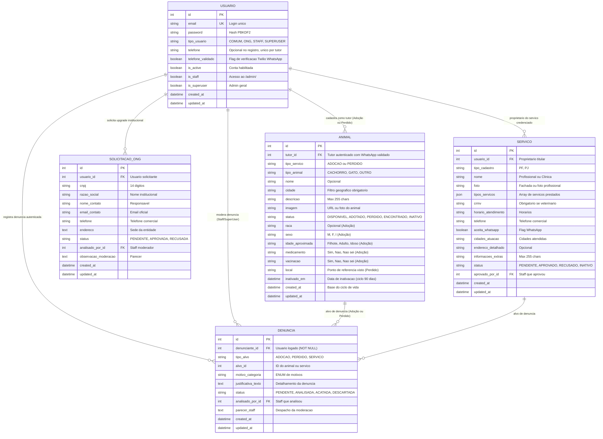

# 🗄️ Modelagem de Dados e Relacionamentos
tags: #banco-de-dados #modelagem #erd #tabelas #django-orm #best-buddy

Este documento detalha a arquitetura relacional de dados do **Best Buddy**, incluindo o **Diagrama Entidade-Relacionamento (ERD)** atualizado e o **Dicionário de Dados** completo.

> [!IMPORTANT]
> **Consolidação de Arquitetura e Decisões de Produto:**
> 1. **Tabela Única de Animais (`animais_animal`):** Os serviços de "Adoção" e "Animal Perdido" foram unificados em uma única tabela `Animal`, diferenciados pela flag `tipo_servico` (`ADOCAO` ou `PERDIDO`).
> 2. **Contato Herdado do Tutor (FK):** O número de contato do anúncio não é mais digitado livremente; ele é obtido diretamente via FK do tutor (`tutor.telefone`), garantindo que apenas números verificados sejam expostos.
> 3. **Validação de WhatsApp via Twilio Verify:** A tabela intermediária de PINs locais (`ValidacaoWhatsapp`) foi **removida**. O controle de OTP ocorre via serviço gerenciado Twilio Verify, e o usuário possui a flag `telefone_validado` diretamente no cadastro.
> 4. **Abandono da Função de Posts:** O mural livre de postagens de usuários (`Post`) foi descontinuado por completo, simplificando o ecossistema e a fila de moderação.
> 5. **Adoção Direta Peer-to-Peer:** A tabela de questionário intermediário de adoção (`Adocao`) permanece descontinuada em favor do contato direto via WhatsApp validado do tutor.

---

## 🗺️ 1. Diagrama Entidade-Relacionamento (ERD)

---

## 📚 2. Dicionário de Tabelas e Campos

### 1. `usuarios_usuario` (Tabela de Usuários)
* **Finalidade:** Gestão de credenciais, contato validado e privilégios de acesso.
* **Campos:**
  - `id` (INTEGER, PK, AutoIncrement)
  - `email` (VARCHAR(254), UNIQUE, NOT NULL): Identificador único de login.
  - `password` (VARCHAR(128), NOT NULL): Hash PBKDF2.
  - `tipo_usuario` (VARCHAR(15), NOT NULL, DEFAULT 'COMUM'): `COMUM`, `ONG`, `STAFF`, `SUPERUSER`.
  - `telefone` (VARCHAR(20), BLANK/NULL): Número de celular com DDD. Opcional no cadastro inicial, mas obrigatório para anunciar animais.
  - `telefone_validado` (BOOLEAN, DEFAULT FALSE): Indica se o número passou por confirmação via Twilio WhatsApp.
  - `is_active` (BOOLEAN, DEFAULT TRUE): Flag de ativação.
  - `is_staff` (BOOLEAN, DEFAULT FALSE): Habilita login no `/admin/`.
  - `is_superuser` (BOOLEAN, DEFAULT FALSE): Superusuário com acesso irrestrito.
  - `created_at` (DATETIME, auto_now_add)
  - `updated_at` (DATETIME, auto_now)

---

### 2. `usuarios_solicitacaoong` (Fila de Homologação de ONGs)
* **Finalidade:** Armazenar dados e histórico de pedidos de upgrade para entidade protetora.
* **Campos:**
  - `id` (INTEGER, PK, AutoIncrement)
  - `usuario_id` (FK -> `usuarios_usuario.id`, ON DELETE CASCADE): Usuário solicitante.
  - `cnpj` (VARCHAR(18), NOT NULL): CNPJ da entidade.
  - `razao_social` (VARCHAR(150), NOT NULL): Nome institucional registrado.
  - `nome_contato` (VARCHAR(100), NOT NULL): Representante legal.
  - `email_contato` (VARCHAR(254), NOT NULL): Email institucional.
  - `telefone` (VARCHAR(20), NOT NULL): Contato comercial.
  - `endereco` (TEXT, NOT NULL): Endereço da sede.
  - `status` (VARCHAR(10), DEFAULT 'PENDENTE'): `PENDENTE`, `APROVADA`, `RECUSADA`.
  - `analisado_por_id` (FK -> `usuarios_usuario.id`, NULL, ON DELETE SET_NULL): Staff moderador.
  - `observacao_moderacao` (TEXT, BLANK/NULL): Parecer do moderador.
  - `created_at` (DATETIME, auto_now_add)
  - `updated_at` (DATETIME, auto_now)

---

### 3. `animais_animal` (Tabela Unificada de Animais: Adoção & Perdidos)
* **Finalidade:** Tabela única compartilhada para ambos os serviços (Animais para Adoção e Animais Perdidos), diferenciada pelo campo `tipo_servico`.
* **Regra de Contato:** O número de contato do anúncio **não é persistido nesta tabela** como string solta; ele é obtido diretamente de `tutor.telefone`. Quando o tutor atualiza e valida um novo número em seu perfil, todos os seus cadastros (adoção ou perdidos) passam a exibir o novo número imediatamente.
* **Campos:**
  - `id` (INTEGER, PK, AutoIncrement)
  - `tutor_id` (FK -> `usuarios_usuario.id`, ON DELETE CASCADE): Usuário anunciante autenticado (exige `telefone_validado == True`).
  - `tipo_servico` (VARCHAR(10), NOT NULL, DEFAULT 'ADOCAO'): `ADOCAO`, `PERDIDO`.
  - `tipo_animal` (VARCHAR(15), NOT NULL, DEFAULT 'CACHORRO'): `CACHORRO`, `GATO`, `OUTRO`.
  - `nome` (VARCHAR(50), BLANK/NULL): Nome do animal (opcional).
  - `cidade` (VARCHAR(100), NOT NULL): Cidade para filtros de busca.
  - `descricao` (VARCHAR(255), BLANK/NULL): Informações limitadas a 255 caracteres.
  - `imagem` (VARCHAR(500), BLANK/NULL): URL ou foto do pet.
  - `status` (VARCHAR(15), DEFAULT 'DISPONIVEL'):
    - Para Adoção: `DISPONIVEL`, `ADOTADO`, `INATIVO`.
    - Para Perdido: `PERDIDO`, `ENCONTRADO`, `INATIVO`.
  - `raca` (VARCHAR(50), BLANK/NULL): Raça (utilizado primariamente em adoção).
  - `sexo` (VARCHAR(1), CHOICES: 'M', 'F', 'I', BLANK/NULL): Sexo do animal.
  - `idade_aproximada` (VARCHAR(15), CHOICES: 'Filhote', 'Adulto', 'Idoso', BLANK/NULL).
  - `medicamento` (VARCHAR(10), CHOICES: 'Sim', 'Não', 'Não sei', BLANK/NULL).
  - `vacinacao` (VARCHAR(10), CHOICES: 'Sim', 'Não', 'Não sei', BLANK/NULL).
  - `local` (VARCHAR(200), BLANK/NULL): Último local visto / ponto de referência (utilizado em animais perdidos).
  - `inativado_em` (DATETIME, NULL, BLANK): Data da inativação automática (regra dos 90 dias).
  - `created_at` (DATETIME, auto_now_add): Base de cálculo de expiração.
  - `updated_at` (DATETIME, auto_now)

---

### 4. `servicos_servico` (Serviços e Clínicas Credenciadas)
* **Finalidade:** Catálogo de estabelecimentos, veterinários e prestadores credenciados.
* **Campos:**
  - `id` (INTEGER, PK, AutoIncrement)
  - `usuario_id` (FK -> `usuarios_usuario.id`, ON DELETE CASCADE): Titular do serviço.
  - `tipo_cadastro` (VARCHAR(2), CHOICES: 'PF', 'PJ'): Tipo fiscal.
  - `nome` (VARCHAR(150), NOT NULL): Nome comercial ou do profissional.
  - `foto` (VARCHAR(500), BLANK/NULL): Fachada ou logo.
  - `tipos_servicos` (JSONField): Seleções de serviços (`veterinario`, `internacao`, `banho_tosa`, `moto_taxi`, `racoes`, `entregas`).
  - `crmv` (VARCHAR(30), BLANK/NULL): Obrigatório caso inclua especialidade veterinária.
  - `horario_atendimento` (VARCHAR(100), BLANK/NULL): Dias e horários.
  - `telefone` (VARCHAR(20), NOT NULL): Contato comercial.
  - `aceita_whatsapp` (BOOLEAN, DEFAULT FALSE): Indicador de WhatsApp.
  - `cidades_atuacao` (VARCHAR(255), NOT NULL): Cidades atendidas.
  - `endereco_detalhado` (VARCHAR(255), BLANK/NULL): Endereço físico opcional.
  - `informacoes_extras` (VARCHAR(255), BLANK/NULL): Limitado a 255 caracteres.
  - `status` (VARCHAR(15), DEFAULT 'PENDENTE'): `PENDENTE`, `APROVADO`, `RECUSADO`, `INATIVO`.
  - `aprovado_por_id` (FK -> `usuarios_usuario.id`, NULL, ON DELETE SET_NULL): Staff moderador.
  - `created_at` (DATETIME, auto_now_add)
  - `updated_at` (DATETIME, auto_now)

---

### 5. `denuncias_denuncia` (Denúncias Autenticadas com Motivo Enum)
* **Finalidade:** Fila centralizada de moderação para conteúdo impróprio ou suspeito, vinculada a usuário autenticado.
* **Campos:**
  - `id` (INTEGER, PK, AutoIncrement)
  - `denunciante_id` (FK -> `usuarios_usuario.id`, NOT NULL, ON DELETE CASCADE): Usuário autenticado.
  - `tipo_alvo` (VARCHAR(20), NOT NULL): `ADOCAO`, `PERDIDO`, `SERVICO` *(alvo `POST` descontinuado)*.
  - `alvo_id` (INTEGER, NOT NULL): ID do registro na tabela correspondente.
  - `motivo_categoria` (VARCHAR(30), NOT NULL): **ENUM:**
    - `MAUS_TRATOS` ("Maus-tratos ou crueldade")
    - `FRAUDE_GOLPE` ("Fraude, golpe ou cobrança indevida")
    - `DADOS_FALSOS` ("Informações ou fotos falsas")
    - `ANIMAL_JA_ADOTADO` ("Animal já foi adotado / indisponível")
    - `SERVICO_CLANDESTINO` ("Exercício ilegal da profissão / sem CRMV")
    - `SPAM_OFENSIVO` ("Conteúdo ofensivo ou spam")
    - `OUTRO` ("Outro motivo")
  - `justificativa_texto` (TEXT, NOT NULL): Detalhamento da denúncia.
  - `status` (VARCHAR(15), DEFAULT 'PENDENTE'): `PENDENTE`, `ANALISADA`, `ACATADA`, `DESCARTADA`.
  - `analisado_por_id` (FK -> `usuarios_usuario.id`, NULL, ON DELETE SET_NULL): Staff responsável.
  - `parecer_staff` (TEXT, BLANK/NULL): Despacho da moderação.
  - `created_at` (DATETIME, auto_now_add)
  - `updated_at` (DATETIME, auto_now)

---

## 🗑️ 3. Tabelas e Recursos Descontinuados

1. **`animais_animalperdido` / `comunidade_animaldesaparecido`:**
   - **Status:** Unificado na tabela `animais_animal` com `tipo_servico='PERDIDO'`.
2. **`animais_validacaowhatsapp`:**
   - **Status:** Removida. A validação do PIN é processada sem persistência local através da API Twilio Verify, marcando a flag `telefone_validado` em `usuarios_usuario`.
3. **`comunidade_post`:**
   - **Status:** Abandonado por completo. O feed livre de postagens de usuários foi removido da arquitetura.
4. **`adocoes_adocao`:**
   - **Status:** Descontinuado em favor do contato direto com o tutor via WhatsApp verificado.

---

## 🔗 Próximas Notas Relacionadas
- [[06 - Matriz de Gap Analysis (O que Adicionar, Ajustar e Remover)]] — Auditoria de alterações.
- [[07 - Plano de Ação e Roadmap de Implementação]] — Roadmap de execução técnica.
- [[02 - Requisitos Funcionais]] — Catálogo atualizado de requisitos funcionais.
